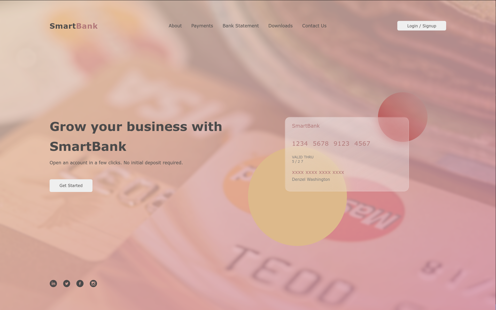

# SmartBank



### By: Samuel Martins

## Table of Content

-   [Description](#description)
-   [Installation Requirement](#usage)
-   [Technology Used](#technologies)
-   [Licence](#licence)
-   [Authors Info](#author-info)

## Description

This is a simple glassmorphism bank desktop concept design.
The main area of focus for this design was glassmorphism. In future updates, a dashboard will be present

The design inspiration came from https://www.behance.net/gallery/129109477/Glassmorphic-Landing-page

## Usage

### Requirements

-   Either a computer,phone,tablet or an Ipad

-   An access to the Internet

### 1. Local Repository

-   Make sure you have a stable internet to have the ability to clone the repository.
-   Type the following command in your terminal to clone this repository

```
git clone https://github.com/thesmartcoder7/smartbank.git
```

If you are using SSH, use the following command

```
git clone git@github.com:thesmartcoder7/smartbank.git
```

When you run the commands successfully, you should have a local version of this repository.

### 2. Online Repository

-   Make sure you have a stable internet for forking this repository.
-   According to the license, you can fork this project. You need ibkt click on the forking icon and it will be added as one of your repositories

Happy coding!

## Technologies

-   HTML5
-   CSS3
-   JavaScript

## Licence

View the license [here](LICENSE)

## Author Info

-   Twitter - [@thesmartcoder7](https://twitter.com/thesmartcoder7)
-   Linkedin - [Samuel Martins](https://www.linkedin.com/in/samuel-martins-09839b115/)
-   Website - [Samuel Martins](https://smart-code.dev)
-   blog - [Samuel Martins](https://samuel-martins.medium.com/)
